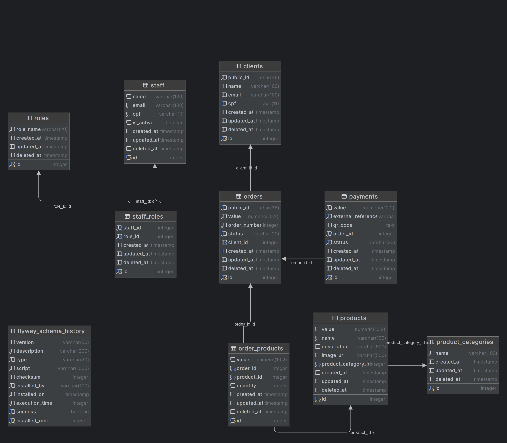
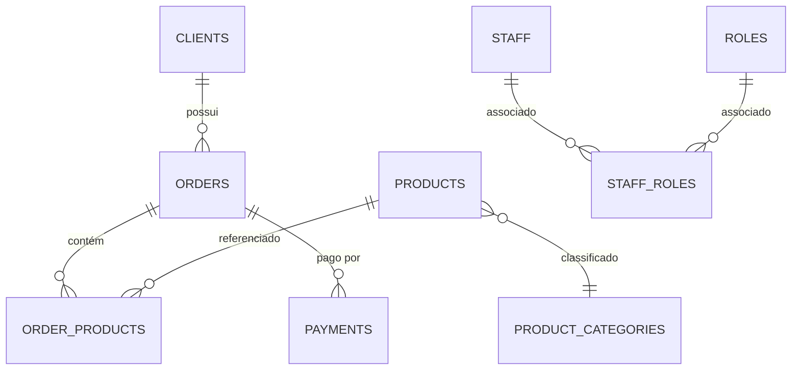

# 🍔 FastFood SOAT Database

Repositório responsável pela gestão da infraestrutura como código (IaC) e estrutura do banco de dados do sistema FastFood SOAT. Este projeto gerencia automaticamente a criação e migração do banco PostgreSQL na AWS usando Terraform e GitHub Actions.

## 📋 Visão Geral

Este projeto implementa:
- **Infraestrutura como Código** com Terraform
- **Banco de dados PostgreSQL** na AWS RDS
- **Migrações automáticas** via GitHub Actions
- **Versionamento de schema** com scripts SQL
- **Integração Discord** para notificações

## 🏗️ Arquitetura

```
┌─────────────────┐    ┌──────────────────┐    ┌─────────────────┐
│  GitHub Actions │    │  AWS RDS         │    │  Discord        │
│                 │───▶│  PostgreSQL 17   │    │  Notifications  │
│  CI/CD Pipeline │    │  (db.t3.micro)   │◀───│                 │
└─────────────────┘    └──────────────────┘    └─────────────────┘
         │                        │
         ▼                        │
┌──────────────────┐              │
│   Terraform      │              │
│   State (S3)     │◀─────────────┘
│   Lock (DynamoDB)│
└──────────────────┘
```

## 🗄️ Estrutura do Banco de Dados

O banco de dados do FastFood SOAT foi projetado para garantir integridade, performance e rastreabilidade, utilizando PostgreSQL 17 na AWS RDS. Abaixo estão os principais componentes e características técnicas:

### Diagrama



### Diagrama Entidade-Relacionamento (ER)



### Tabelas e Campos

#### 1. clients
- **id**: PK, auto-incremento
- **public_id**: UUID público (char(36)), indexado
- **name, email, cpf**: Dados cadastrais, CPF indexado (hash)
- **created_at, updated_at, deleted_at**: Auditoria e soft delete
- **Triggers**: Atualização automática de updated_at

#### 2. orders
- **id**: PK, auto-incremento
- **public_id**: UUID público, indexado (hash)
- **value**: Valor total do pedido
- **order_number**: Sequencial
- **status**: Status do pedido, indexado
- **client_id**: FK para clients
- **created_at, updated_at, deleted_at**: Auditoria
- **Índices**: status+created_at, created_at (B-tree, BRIN)
- **Triggers**: Atualização automática de updated_at

#### 3. product_categories
- **id**: PK, auto-incremento
- **name**: Nome da categoria
- **created_at, updated_at, deleted_at**: Auditoria
- **Triggers**: Atualização automática de updated_at

#### 4. products
- **id**: PK, auto-incremento
- **value**: Preço
- **name, description, image_url**: Dados do produto
- **product_category_id**: FK para product_categories
- **created_at, updated_at, deleted_at**: Auditoria
- **Triggers**: Atualização automática de updated_at

#### 5. order_products
- **id**: PK, auto-incremento
- **value**: Valor do item
- **order_id**: FK para orders
- **product_id**: FK para products
- **quantity**: Quantidade
- **created_at, updated_at, deleted_at**: Auditoria
- **Triggers**: Atualização automática de updated_at

#### 6. payments
- **id**: PK, auto-incremento
- **value**: Valor pago
- **external_reference**: Referência externa, indexada (hash)
- **qr_code**: Dados do QR Code
- **order_id**: FK para orders
- **status**: Status do pagamento, indexado (hash)
- **created_at, updated_at, deleted_at**: Auditoria
- **Triggers**: Atualização automática de updated_at

#### 7. staff
- **id**: PK, auto-incremento
- **name, email, cpf**: Dados do funcionário
- **is_active**: Status de ativação
- **created_at, updated_at, deleted_at**: Auditoria
- **Triggers**: Atualização automática de updated_at

#### 8. roles
- **id**: PK, auto-incremento
- **role_name**: Nome do cargo
- **created_at, updated_at, deleted_at**: Auditoria
- **Triggers**: Atualização automática de updated_at

#### 9. staff_roles
- **id**: PK, auto-incremento
- **staff_id**: FK para staff
- **role_id**: FK para roles
- **created_at, updated_at, deleted_at**: Auditoria
- **Triggers**: Atualização automática de updated_at

#### 10. flyway_schema_history
- **installed_rank**: PK
- **version, description, type, script, checksum, installed_by, installed_on, execution_time, success**: Controle de migrações
- **Índice**: success

### Características Técnicas

- **Soft Delete**: Todas as tabelas possuem o campo deleted_at
- **Auditoria**: Campos created_at e updated_at com triggers automáticas
- **UUIDs**: Identificação segura para entidades públicas
- **Índices**: Hash, B-tree e BRIN para performance
- **Triggers**: Função update_timestamp() para atualização automática de timestamps
- **Relacionamentos**: Integridade referencial via FKs

### Fluxo de Dados

1. **Cadastro de Cliente**: clients → orders
2. **Pedido**: orders → order_products → products
3. **Pagamento**: payments vinculado ao pedido
4. **Gestão de Funcionários**: staff → staff_roles → roles

## 📁 Estrutura do Projeto

```
├── 📁 scripts/                         # Migrações SQL versionadas
│   ├── V1__init.sql                    # Schema inicial
│   └── V2__insert_initial_data.sql     # Dados base
├── 📁 infra/                           # Infraestrutura
│   ├── 📁 terraform/                   # Infraestrutura AWS
│   │   ├── backend.tf                  # Configuração do backend (tfstate)
│   │   ├── data.tf                     # Recuperando recursos da AWS
│   │   ├── destroy_config.json         # Define se deve ser aplicado o destroy
│   │   ├── main.tf                     # Configuração do Terraform
│   │   ├── outputs.tf                  # Define o output do endpoint do rds
│   │   ├── provider.tf                 # Configura o provider da AWS (sa-east-1)
│   │   ├── rds.tf                      # Configura subnet-group do rds e instancia rds
│   │   ├── security.tf                 # Security Groups
│   │   └── 📁 envs/                    # Variáveis por ambiente
│   │       ├── 📁 dev/                 # Config do ambiente de DEV
│   │       │   └── terraform.tfvars    # Variaveis de ambiente de DEV
│   │       └── 📁 prod/                # Config do ambiente de PROD
│   │           └── terraform.tfvars    # Variaveis de ambientte de PROD
│   └── 📁 scripts/                     # Automação Python
│       ├── run_scripts.py              # Executor de migrações
│       └── requirements.txt            # Dependências Python
├── 📁 .github/workflows/               # CI/CD Pipelines
└── config.yaml                         # Definição dos scripts que serão executados
```

## 🚀 CI/CD Pipelines

### Workflows Disponíveis

| Workflow | Trigger | Ambiente | Função |
|----------|---------|----------|--------|
| `main.yaml` | Push para `main` | **PROD** | Deploy produção |
| `release.yaml` | Push para `release/*` | **DEV** | Deploy desenvolvimento |
| `workflow-pull-request.yaml` | Pull Request | - | Notificações Discord |
| `database.yaml` | Reutilizável | Configurável | Deploy completo |

### Fluxo de Deploy

```mermaid
    A[Push Code] --> B[GitHub Actions]
    B --> C[Terraform Plan]
    C --> D[Terraform Apply]
    D --> E[Run SQL Scripts]
    E --> F[Discord Notification]
```

## 🔐 Configuração das GitHub Secrets

### AWS (IAM Roles - Recomendado)
```bash
AWS_GITHUB_ACTIONS_ROLE_ARN    # ARN da role IAM para GitHub Actions
AWS_REGION                     # Região AWS (ex: sa-east-1)
AWS_STATEFILE_S3_BUCKET        # Bucket S3 para Terraform state
AWS_LOCK_DYNAMODB_TABLE        # Tabela DynamoDB para Terraform lock (partition key: LockID)
```

### Database
```bash
DB_NAME                        # Nome do banco PostgreSQL
DB_USERNAME                    # Usuário do PostgreSQL
DB_PASSWORD                    # Senha do PostgreSQL
```

### Network Security
```bash
ALLOWED_CIDR                   # CIDR permitido para acesso ao RDS
```

### Discord Notifications
```bash
DISCORD_BUILD_WEBHOOK          # Webhook para notificações de build
DISCORD_PULLREQUEST_WEBHOOK    # Webhook para notificações de PR
```

### Como Configurar
1. Acesse: `Settings` → `Secrets and variables` → `Actions`
2. Configure todas as 10 secrets listadas acima
3. Certifique-se de que a AWS IAM Role tenha as permissões necessárias

## 🏗️ Pré-requisitos AWS

### Infraestrutura Base
- [x] **IAM Role** configurada com OIDC para GitHub Actions
- [x] **S3 Bucket** para Terraform state
- [x] **DynamoDB Table** para Terraform lock
- [x] **VPC** com subnets públicas taggeadas (`Name: fastfood-vpc`)

### Permissões IAM Necessárias
```json
{
  "Version": "2012-10-17",
  "Statement": [
    {
      "Effect": "Allow",
      "Action": [
        "rds:*",
        "ec2:*",
        "s3:*",
        "dynamodb:*"
      ],
      "Resource": "*"
    }
  ]
}
```

## 🛠️ Como Usar

### 1. Configuração Inicial
```bash
# Clone o repositório
git clone https://github.com/seu-usuario/fastfood-soat-database.git
cd fastfood-soat-database

# Configure o repositório no seu GitHub
# Configure as secrets no GitHub
# Certifique-se de ter a infraestrutura AWS base
```

### 2. Deploy Desenvolvimento
```bash
# Crie uma branch release
git checkout -b release
git push origin release

# GitHub Actions irá automaticamente:
# 1. Executar Terraform para criar/atualizar RDS
# 2. Executar scripts SQL de migração
# 3. Notificar resultado no Discord
```

### 3. Deploy Produção
```bash
# Merge para main após testes
git checkout main
git merge release
git push origin main

# Deploy automático em produção
```

### 4. Executar Scripts Localmente (Opcional)
```bash
# Configure as variaveis de ambiente
#   DB_HOST
#   DB_USER
#   DB_PASS
#   DB_NAME
cd infra/scripts
pip install -r requirements.txt

# Configure config.yaml com suas credenciais
python run_scripts.py
```

## ⚙️ Configuração dos Scripts SQL

### Arquivo `config.yaml`

O arquivo `config.yaml` é o **coração da execução das migrações**, definindo quais scripts SQL serão executados e em qual ordem.

#### Estrutura do `config.yaml`
```yaml
# Scripts SQL a serem executados (ORDEM IMPORTA!)
scripts:
  - V1__init.sql
  - V2__insert_initial_data.sql
```
#### Como Funciona a Execução

1. **Leitura do Config**: O `run_scripts.py` carrega o `config.yaml`
2. **Validação**: Verifica conexão com banco e existência dos arquivos
3. **Execução Sequencial**: Roda cada script na ordem definida
4. **Log de Progresso**: Registra sucesso/falha de cada script nos logs
5. **Relatório Final**: Sumário da execução completa

### Adicionando Novos Scripts

Para adicionar uma nova migração:

1. **Crie o script SQL** em `/scripts/` (ex: `V3__add_new_table.sql`)
2. **Atualize o `config.yaml`**:
   ```yaml
   scripts:
     # ...scripts existentes...
     - V3__add_new_table.sql
     # Basta definir o nome do arquivo, a pipeline já considera o diretório scripts
   ```
3. **Commit e push** - o CI/CD executará automaticamente

## 📊 Monitoramento

### Discord Notifications
- **Build Status**: Sucesso/falha dos deploys
- **Pull Requests**: Notificações de novos PRs
- **Erros**: Alertas de problemas na pipeline

## 🔧 Configuração de Ambientes

### Desenvolvimento (`envs/dev/terraform.tfvars`)
```hcl
# No momento todos estão sendo definidos por variaveis de ambiente TF_VAR, pois são dados sensíveis,
# recuperados de secrets do GitHub.
```

### Produção (`envs/prod/terraform.tfvars`)
```hcl
# No momento todos estão sendo definidos por variaveis de ambiente TF_VAR, pois são dados sensíveis,
# recuperados de secrets do GitHub.
```

## 🚨 Troubleshooting

### Problemas Comuns

| Problema | Solução |
|----------|---------|
| "Role não encontrada" | Verificar `AWS_GITHUB_ACTIONS_ROLE_ARN` |
| "Bucket não existe" | Criar bucket S3 para Terraform state |
| "Subnet não encontrada" | Verificar tags da VPC (`Name: fastfood-vpc`) |
| "Script SQL falhou" | Verificar logs no GitHub Actions |
